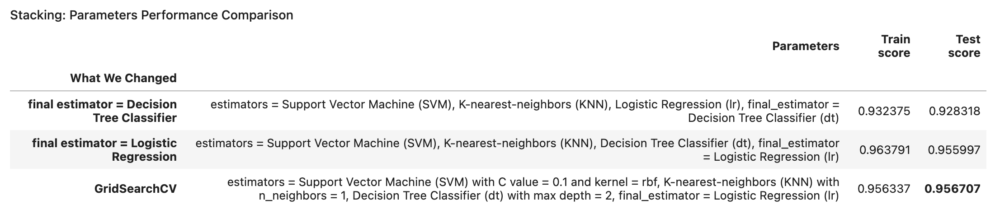
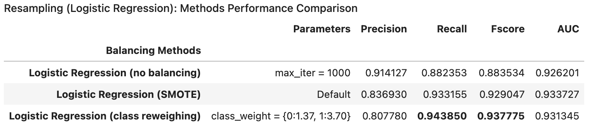
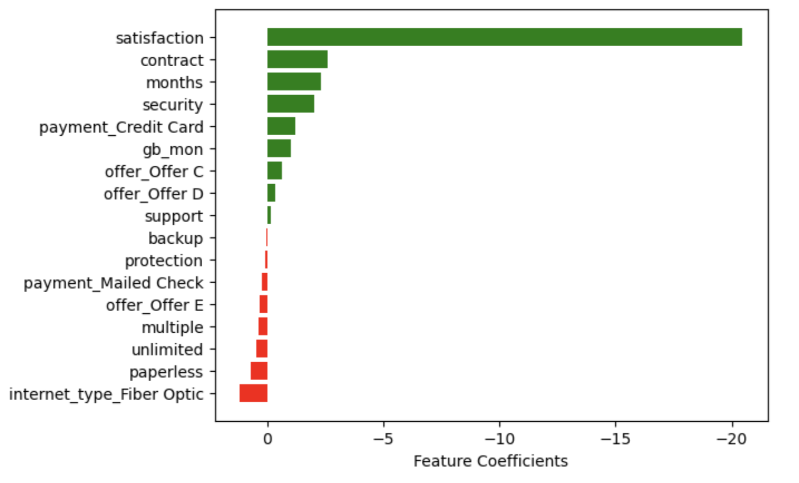
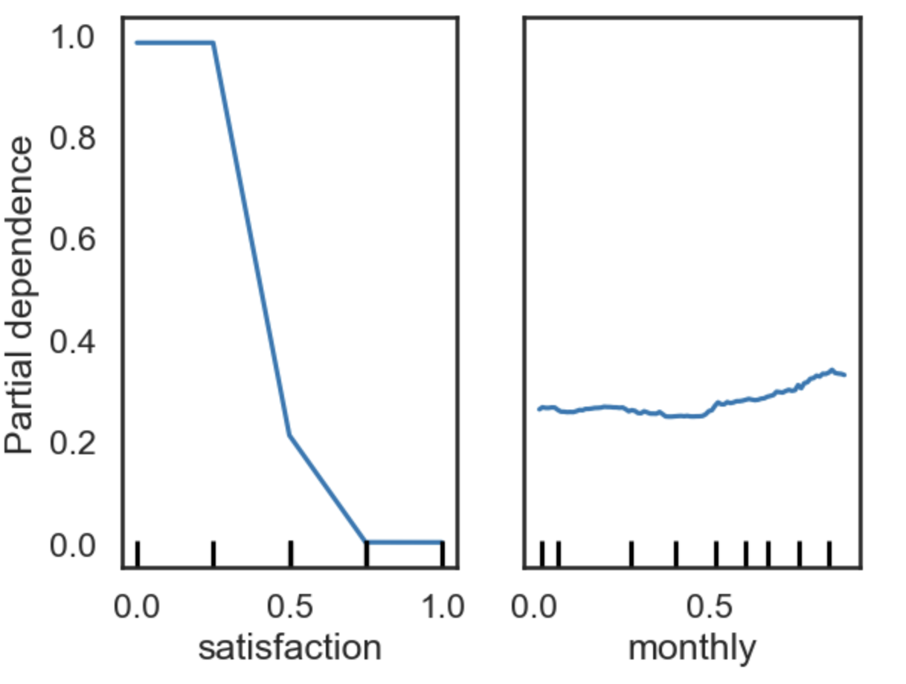

_README file Last updated: [March 2026]_

## Machine Learning Project: Classification 

## Executive Summary

- Built and evaluated multiple classification models to predict customer churn (~7000 customers, 50+ features)
- Best overall model: **Stacking (Accuracy = 0.957)** with strong generalization
- Best business model: **Class-weighted Logistic Regression (Recall = 0.9438)** to capture churners
- Key drivers of churn: **low satisfaction, high monthly charges, short tenure, lack of contract**
- Business impact: Enables targeted retention strategies to reduce churn risk

   

## Techniques Used:

- **Models:** Logistic Regression (L1, L2, Elastic Net), KNN, SVM, Decision Tree, Bagging, Random Forest, Extra Trees, AdaBoost, XGBoost, Stacking  
- **Imbalance Handling:** SMOTE, Class Reweighting, Random Undersampling  
- **Evaluation:** Accuracy, Precision, Recall, F1 Score, ROC-AUC, Confusion Matrix, Precision-Recall Curve  
- **Validation & Tuning:** Train/Test Split, GridSearchCV (hyperparameter tuning), Overfitting Gap Analysis  
- **Interpretability:** Permutation Feature Importance, Partial Dependency Plots (PDP), Global Surrogate Models, LIME  

   

## Detailed Sections

**Objective:** 

Predict customer churn using telecommunications data and evaluate multiple classification models to optimize retention strategy

**Dataset:** 

- ~7000 customers, 50+ features
- Mix of categorical (contract type, internet type, etc.) and numerical (monthly charges, data usage, etc.) features
- Target: Churn value (0 = stay, 1 = churn)

**Data Processing:**

- Merged multiple tables into a single customer level dataset
- Standardized join key (Customer ID)
- Removed leakage features (post outcome variables like CLTV)
- One hot encoded categorical variables
- Applied min-max scaling
- Train test split (80/20)

**Modeling:**

- Logistic regression
  - L2 Regularization (Ridge)
  - L1 Regularization (Lasso)
  - Elastic Net
- K Nearest Neighbors (KNN)
- Support Vector Machine (SVM)
- Tree Based Models
  - Decision Tree
  - Bootstrap Aggregation (Bagging)
  - Random Forest
  - Extra Trees
- Boosting
  - AdaBoost
  - XGBoost
- Ensemble Methods
  - Stacking

**Handling Class Imbalance (Balancing Methods):**
 
- Balancing Methods
  - Synthetic Minority Oversampling Technique (SMOTE)
  - Class Reweighing
  - Random Undersampling

**Model evaluation:**

- Metrics
  - Accuracy 
  - Precision
  - Recall
  - F1 Score
  - AUC (ROC)
- Validation
  - Train vs. Test Score Comparison
  - GridSearchCV for hyperparameter tuning
  - Confusion Matrix Analysis
  - ROC & Precision-Recall Curves

**Results:**

Best Model for Test Accuracy

- Stacking (tuned with GridSearchCV)
  - Models stacked: Support Vector Machine (SVM), K nearest neighbors (KNN), Decision Tree Classifier (dt), Final Estimator = Logistic regression (LR)
- **Accuracy = 0.957**
- Highest test accuracy
- Strong generalization (low overfitting gap = 0.00037)

Best for Recall (business-critical)

- Class reweighting + Logistic Regression
- **Recall = 0.9438**
- Compared to Logistic Regression without class reweighing
  - Significantly improved recall (caught more churners)
  - Slight drop in precision (acceptable tradeoff)

**Key Insights:**

- Satisfaction → strongest predictor (low satisfaction = high churn risk)
- Monthly charges → higher cost increases churn
- Contract type → long-term contracts reduce churn
- Tenure (months) → longer customers are less likely to churn

**Model Interpretability:**

- Permutation Feature Importance
- Partial Dependency Plot (PDP)
- Global Surrogate Models
- Local Interpretable Model-agnostic Explanations (LIME)

   

## Business Impact & Recommendations

-	Target customers with low satisfaction scores early with retention campaigns
- Offer discounts or incentives for high monthly charge customers (like fiber optic internet customers)
- Encourage long term contracts to reduce churn risk
- Focus retention efforts on new customers (low tenure)

   

## Images:

  

 

  <em><strong>Stacking: Parameters Performance Comparison Table. 
    Stacking (tuned with GridSearchCV) is our best model for test accuracy (value in bold).</strong></em>

   

  

 

  <em><strong>Resampling (Logistic Regression): Methods Performance Comparison Table. 
    Class reweighting + Logistic Regression is our best model for recall (value in bold).</strong></em>

   

  

 

  <em><strong>Feature importance plot. 
    We can see that satisfaction has an overwhelming influence on keeping customers (don't churn). 
    The customer having fiber optic internet type has the highest influence on losing customers (churn).</strong></em>

   

  

 

  <em><strong>Partial Dependency Plot (PDP). 
    Higher Value of partial dependence indicates higher probability to churn. 
    Our two most important features for churn (satisfaction and monthly charges). </strong></em>

